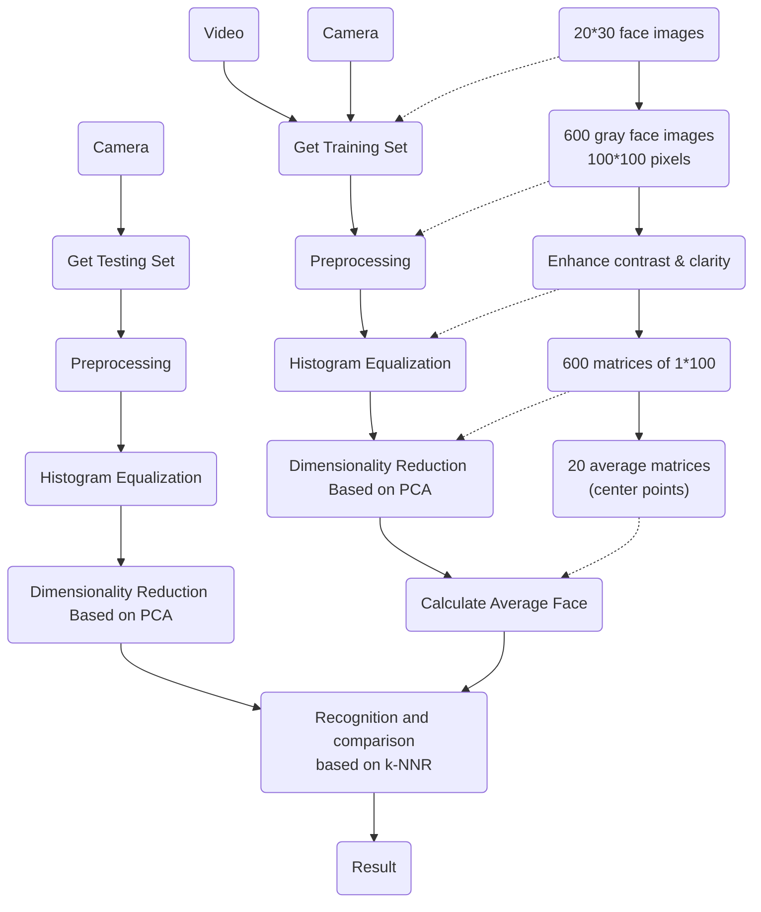

# Face Recognition System Program Design Report
## 1. Abstract
In our face recognition project, we developed a real-time facial recognition program based on Principal Component Analysis (PCA). Initially, we created a system capable of identifying faces in real time. Subsequently, we conducted extensive testing by varying the dimensions reduced using PCA and exploring different face recognition methods (NCC, k-NN, SVM). After rigorous evaluation, we identified the optimal dimensionality reduction and face recognition technique, achieving and impressive accuracy rate of 95.3%. Our report concludes by summarizing the challenges encountered during the project and the corresponding solutions.
## 2. Algorithm design
### 2.1 System flow chart

### 2.2 Code analysis
#### Obtaining of the data set
In our project, both the training and testing image sets are made up of the images captured by a separated program. It can capture face images both from videos and webcam. The program is written in python using OpenCV 2.0. We asked our relatives send some short videos containing faces for us to gather images.\
The program captures images from a video (or webcam), detects faces using the Haar cascade classifier, and optionally saves detected faces as images. Firstly, it continuously retrieves frames from the video (or webcam). Then, it converts the images to grayscale, and identifies faces based on intensity gradients. For each detected face, a bounding rectangle is drawn, and the face in the rectangle is saved as an image. Finally, the saved face images are resized to 100*100 pixels and stored in a directory, whose name is the name of the person who provided the face images. We got a training set containing a set of 20 people with 10 images each and a testing test containing 30 images each.
#### Preprocessing
The second step is to read the images from the folder to the main program, and preprocess them. We begin by listing the contents of the “face_train” directory using os.listdir(). Then, we resize each image to 100*100 pixels (though we have already done this in the dataset containing step, one more confirmation is more convincing), and perform histogram equalization on the images to make it easier to recognize. The resulting processed images are stored in the images list. Finally, we flatten each image into a one-dimensional array and create the feature matrix “X_train” for further analysis.
#### Feature Extraction Using PCA
In this part, we start by calculating the mean of each feature in the feature matrix X_train and then center the data by subtracting this mean from each feature value. Next, we perform Singular Value Decomposition (SVD) on the centered matrix, resulting in three matrices: U (the principal components), S (the singular values), and Vt (the transpose of right singular vectors). But we use U only. We select the top 100 principal components from U and create a reduced-dimensional feature matrix called “X_train_pca”. Finally, we compute the transformation matrix P by taking the dot product of the transpose of “X_train” and “X_train_pca”. This process allows us to capture essential information while reducing dimensionality.
#### Real-time Face Recognition Using k-NNR
This is the main process of our program, doing the face recognition. There are seven steps in this process.
1. Video Capture: The cap object is created to capture video from the webcam. The video stream serves as input for face detection and recognition
2. Face Detection: Inside the loop, each frame from the webcam feed is converted to
grayscale. The classifier detects faces in the grayscale frame using detectMultiScale(). Then the face is resized to a fixed size of 100*100 pixels.
3. Feature Extraction and Normalization: The face is flattened into a one-dimension matrix, and stored in test_vector. Then calculate the mean of test_vector and subtracted to center the data test_vector_centered.
4. PCA Transformation: The PCA transformation is applied to “test_vector_centered” using the previously computed transformation matrix P. The resulting “test_vector_pca” represents the face in the reduced-dimensional space.
5. Finding Nearest Neighbors: The Euclidean distance between “test_vector_pca” and each training vector in “X_train_pca” is calculated. The indices of the three nearest neighbors are stored in “nearest_indices”.
6. Majority Voting: The indices are divided by 10 to determine the corresponding person (since there are 10 images per person in the training set). The most common index (person) among the nearest neighbors is identified as the recognized person.
7. Displaying Results: The recognized person’s label (name) is displayed on the frame using putText() and a bounding rectangle around the detected face.
## 3. Test results and discussion
### 3.1.Introduction
In this session, we test the performance of our program through two cases. One is the algorithm of face recognition. Another is the Dimension of images through PCA. For the first case, to perform the experiment, we compared three different recognition algorithms horizontally, which are Nearest Center Classifier (NCC) , k-Nearest Neighbor Rule (k-NNR), and Support Vector Machines (SVM), to fine the one with the highest accuracy.\
Among them, NCC and k-NNR both use the Euclidean distance between the training vector and the test vector to calculate the training vector closest to the test vector. However, NCC calculates the average vector of which training vector the test vector is closest to. And k-NNR calculates which category has the most among the k training vectors closest to the test vector.
#### Using k-NNR for face recognition:
```python
# Calculate the Euclidean norm between each test vector
# and each training vector
for i in range(len(X_test)):
    test_vector = X_test[i]

    # Normalized test vector
    test_vector = test_vector - np.mean(test_vector, axis=0)

    # PCA on test vectors
    test_vector = np.dot(test_vector, P)

    # Initialize a list to store the Euclidean norm of each training vector
    # and the current test vector
    distances = []

    for j in range(len(X_train_pca)):
        train_vector = X_train_pca[j]
        dist = np.sqrt(np.sum((train_vector - test_vector) ** 2))
        distances.append(dist)

    # Find the k nearest neighbors
    nearest_indices = np.argsort(distances)[:4]

    # Find the most frequent index
    counts = Counter(nearest_indices // 10 + 1)
    most_common_index = counts.most_common(1)[0][0]

    # Check if the indexes are the same
    if most_common_index == (i // 30) + 1:
        true_count += 1

    #print(i)
```
#### Using NCC for face recognition:
```python
# Calculate the Euclidean norm between each test vector
# and each average training vector
for i in range(len(X_test)):
    test_vector = X_test[i]

    # Normalized test vector
    test_vector = test_vector - np.mean(test_vector, axis=0)

    # PCA on test vectors
    test_vector = np.dot(test_vector, P)

    # Initialize a list to store the Euclidean norm of each training vector
    # and the current test vector
    distances = []

    for j in range(len(X_train_average)):
        train_vector = X_train_average[j]
        distance = np.linalg.norm(train_vector - test_vector)
        distances.append(distance)

    # Find the training vector index with minimum distance
    min_distances_index = np.argmin(distances)

    # Check if the indexes are the same
    if min_distances_index + 1 == (i // 30) + 1:
        true_count += 1
```
#### Using SVM for face recognition:
```python
class MultiClassSVM:
    def __init__(self, X, y, k, C=1, tol=1e-5, max_iter=1000, learning_rate=0.01):
        self.X = X
        self.y = y
        self.k = k
        self.C = C
        self.tol = tol
        self.max_iter = max_iter
        self.learning_rate = learning_rate
        self.n_samples, self.n_features = X.shape
        self.n_classes = len(np.unique(y))
        self.W = np.random.rand(self.n_features, self.n_classes)
        self.b = np.random.rand(self.n_classes)
        self.losses = []

    def hinge_loss(self, X, y, W, b):
        scores = np.dot(X, W) + b
        correct_class_score = scores[np.arange(self.n_samples), y]
        margins = np.maximum(0, scores - correct_class_score[:, np.newaxis] + 1)
        margins[np.arange(self.n_samples), y] = 0
        margins[margins > 0] = 1
        loss = np.sum(margins) / self.n_samples
        return loss

    def fit(self):
        for i in range(self.max_iter):
            scores = np.dot(self.X, self.W) + self.b
            correct_class_score = scores[np.arange(self.n_samples), self.y]
            margins = np.maximum(0, scores - correct_class_score[:, np.newaxis] + 1)
            margins[np.arange(self.n_samples), self.y] = 0
            margins[margins > 0] = 1
            row_sum = np.sum(margins, axis=1)
            margins[np.arange(self.n_samples), self.y] = -row_sum
            dW = np.dot(self.X.T, margins) / self.n_samples
            db = np.sum(margins, axis=0) / self.n_samples
            dW += self.C * self.W
            self.W -= self.learning_rate * dW
            self.b -= self.learning_rate * db
            loss = self.hinge_loss(self.X, self.y, self.W, self.b)
            self.losses.append(loss)
            if i % 10 == 0:
                print(f'Iter %d / %d: loss %f' % (i, self.max_iter, loss))

    def predict(self, X):
        scores = np.dot(X, self.W) + self.b
        y_pred = np.argmax(scores, axis=1)
        return y_pred

    def score(self, X, y):
        y_pred = self.predict(X)
        accuracy = np.mean(y_pred == y)
        return accuracy

    def get_params(self):
        return self.W, self.b

    def get_losses(self):
        return self.losses
```
For the second case, we try to find the parameter of dimension that best fit the
PCA algorithm through testing the success rate and the calculation speed.
#### 3.1.2 Nearest Center Classifier (NCC)
##### Pros
- **Simplicity**: NCC is also a simple method where the class of a new instance is determined by the class of the nearest mean of the training instances.
- **Efficiency**: NCC is computationally efficient as it only requires the computation of the distances to the class centers.
- It works well when the data is well separated.
##### Cons
- **Assumptions about data**: NCC assumes that the data is normally distributed and the classes are equally distributed, which may not be the case in real-world data.
- **Sensitivity to outliers**: NCC is sensitive to outliers as they can significantly shift the class centers.
- It may not work well when the data is not well separated or when the class distributions are imbalanced.
#### 3.1.3 Support Vector Machines (SVM)
##### Pros
- **Effective in high dimensional spaces**: SVMs are effective when the number of dimensions is greater than the number of samples.
- **Robust to outliers**: SVMs are less sensitive to outliers as they focus on the instances near the decision boundary (support vectors).
- **Kernel**: SVMs can solve non-linear problems using the kernel, mapping their inputs into high-dimensional feature spaces.

###### Cons
- **Complexity and tuning**: The choice of the appropriate kernel function can be complex. Also, SVMs have several hyperparameters (like C, gamma) which need to be optimally tuned, which can be time-consuming.
- **Not directly applicable to multi-class classification**: SVMs are inherently binary classifiers. For multi-class problems, strategies like one-vs-one or one-vs-all need to be applied.
## 3.2 Comparison among Different Algorithms of face recognitio
### Results of Different Algorithms
| Average Accuracy | KNNR | NCC  | SVM  |
|------------------|------|------|------|
| 20               | 0.943333 | 0.908333 | 0.908333 |
| 30               | 0.95    | 0.9116667 | 0.9183333 |
| 40               | 0.95    | 0.9116667 | 0.9183333 |
| 50               | 0.948333 | 0.9116667 | 0.9183333 |
| 60               | 0.948333 | 0.9116667 | 0.9183333 |
| 70               | 0.948333 | 0.9116667 | 0.9183333 |
| 80               | 0.948333 | 0.9116667 | 0.9183333 |
| 90               | 0.948333 | 0.9116667 | 0.9183333 |
| 100              | 0.948333 | 0.9116667 | 0.9183333 |
| 110              | 0.948333 | 0.9116667 | 0.9183333 |
| 120              | 0.948333 | 0.9116667 | 0.9183333 |


It can be seen from the Table 1 that after PCA dimensionality reduction, the accuracy of KNNR algorithm is significantly higher than that of SVM algorithm and NCC algorithm, reaching 0.95, and the accuracy of SVM algorithm 0.92 is slightly higher than that of NCC algorithm 0.91. Therefore, next, we mainly study the accuracy and completion time of KNNR algorithm after PCA reduction of different dimensions.
## 3.3 Comparison among Different Dimensions of images through PCA
### KNNR
| Dimension | Cases 1 | Cases 2 | Cases 3 | Cases 4 | Cases 5 | Average |
|-----------|---------|---------|---------|---------|---------|---------|
| 20        | 0.9433333 | 0.9433333 | 0.9433333 | 0.9433333 | 0.9433333 | 0.9433333 |
| 30        | 0.95     | 0.95     | 0.95     | 0.95     | 0.95     | 0.95     |
| 40        | 0.95     | 0.95     | 0.95     | 0.95     | 0.95     | 0.95     |
| 50        | 0.9483333 | 0.9483333 | 0.9483333 | 0.9483333 | 0.9483333 | 0.9483333 |
| 60        | 0.9483333 | 0.9483333 | 0.9483333 | 0.9483333 | 0.9483333 | 0.9483333 |
| 70        | 0.9483333 | 0.9483333 | 0.9483333 | 0.9483333 | 0.9483333 | 0.9483333 |
| 80        | 0.9483333 | 0.9483333 | 0.9483333 | 0.9483333 | 0.9483333 | 0.9483333 |
| 90        | 0.9483333 | 0.9483333 | 0.9483333 | 0.9483333 | 0.9483333 | 0.9483333 |
| 100       | 0.9483333 | 0.9483333 | 0.9483333 | 0.9483333 | 0.9483333 | 0.9483333 |
| 110       | 0.9483333 | 0.9483333 | 0.9483333 | 0.9483333 | 0.9483333 | 0.9483333 |
| 120       | 0.9483333 | 0.9483333 | 0.9483333 | 0.9483333 | 0.9483333 | 0.9483333 |

### Time (s) for KNNR
| Dimension | Cases 1 | Cases 2 | Cases 3 | Cases 4 | Cases 5 | Average |
|-----------|---------|---------|---------|---------|---------|---------|
| 20        | 1.6638116 | 1.5207074 | 1.5779807 | 1.4990960 | 1.7039218 | 1.59310350 |
| 30        | 1.5100508 | 1.6826395 | 1.537406 | 1.916023 | 1.6632335 | 1.66191354 |
| 40        | 1.498820 | 1.940683 | 1.5425724 | 1.690805 | 1.863195 | 1.7040454 |
| 50        | 1.6199005 | 1.7901430 | 1.6861869 | 1.535824 | 1.6842760 | 1.66117776 |
| 60        | 1.520658 | 1.5445248 | 1.6582389 | 1.552610 | 1.6530308 | 1.58568426 |
| 70        | 1.9213270 | 2.012382 | 2.108089 | 1.7889013 | 1.9263414 | 1.95140844 |
| 80        | 2.508395 | 2.123804 | 2.492802 | 2.3137979 | 2.370727 | 2.31015414 |
| 90        | 2.3677163 | 2.108692 | 2.1440287 | 2.3421870 | 2.0896315 | 2.21068654 |
| 100       | 2.526475 | 2.088193 | 2.206255 | 2.197661 | 2.160998 | 2.24303164 |
| 110       | 2.287102 | 2.1104159 | 2.71393 | 2.293894 | 2.253742 | 2.22673054 |
| 120       | 2.6684425 | 2.3752618 | 2.520246 | 2.5079256 | 2.399710 | 2.49436938 |

### KNNR(20 - 30)
| Dimension | Cases 1 | Cases 2 | Cases 3 | Cases 4 | Cases 5 | Average |
|-----------|---------|---------|---------|---------|---------|---------|
| 20        | 0.9433333 | 0.9433333 | 0.9433333 | 0.9433333 | 0.9433333 | 0.9433333 |
| 21        | 0.94833333 | 0.94833333 | 0.94833333 | 0.94833333 | 0.94833333 | 0.94833333 |
| 22        | 0.94833333 | 0.94833333 | 0.94833333 | 0.94833333 | 0.94833333 | 0.94833333 |
| 23        | 0.95     | 0.95     | 0.95     | 0.95     | 0.95     | 0.95     |
| 24        | 0.95333333 | 0.95333333 | 0.95333333 | 0.95333333 | 0.95333333 | 0.95333333 |
| 25        | 0.95333333 | 0.95333333 | 0.95333333 | 0.95333333 | 0.95333333 | 0.95333333 |
| 26        | 0.95     | 0.95     | 0.95     | 0.95     | 0.95     | 0.95     |
| 27        | 0.95     | 0.95     | 0.95     | 0.95     | 0.95     | 0.95     |
| 28        | 0.95     | 0.95     | 0.95     | 0.95     | 0.95     | 0.95     |
| 29        | 0.95     | 0.95     | 0.95     | 0.95     | 0.95     | 0.95     |
| 30        | 0.95     | 0.95     | 0.95     | 0.95     | 0.95     | 0.95     |

### Time (s) for KNNR(20 - 30)
| Dimension | Cases 1 | Cases 2 | Cases 3 | Cases 4 | Cases 5 | Average |
|-----------|---------|---------|---------|---------|---------|---------|
| 20        | 1.6638116 | 1.5207074 | 1.5779807 | 1.4990960 | 1.7039218 | 1.5931035 |
| 21        | 1.8932171 | 1.546899 | 1.865976 | 1.692845 | 1.692845 | 1.693716 |
| 22        | 1.9428724 | 1.761938 | 1.643705 | 1.619642 | 1.592469 | 1.675553 |
| 23        | 1.614594 | 1.771496 | 1.556698 | 1.618442 | 1.512085 | 1.615888 |
| 24        | 1.577983 | 1.667453 | 1.523918 | 1.6228045 | 1.494136 | 1.577313 |
| 25        | 1.8036468 | 1.6520707 | 1.4953409 | 1.6427415 | 1.7342717 | 1.665654 |
| 26        | 1.781945 | 1.619937 | 1.683098 | 1.7008628 | 1.684772 | 1.680634 |
| 27        | 1.642859 | 1.954542 | 1.710045 | 1.768658 | 1.678657 | 1.698985 |
| 28        | 1.809805 | 2.963722 | 1.646985 | 1.792305 | 1.803241 | 1.87324 |
| 29        | 1.711687 | 1.72164 | 1.566399 | 1.583281 | 1.583281 | 1.63325 |
| 30        | 1.510058 | 1.6826395 | 1.537406 | 1.916023 | 1.6632335 | 1.659714 |
## 4. Problems and solutions
### 4.1 The way of collecting dataset
#### Problem
When collecting training and test sets, we encountered the challenges of slow data collection and insufficient sample size. Our requirement was to gather face images for 20 individuals, including 10 training images and 30 test images for each person. Initially, we attempted on-site photography, but the number of people available was insufficient. Subsequently, we searched for online publicly available face datasets, but the image count for each individual remained inadequate. Additionally, the need for further face detection and pixel standardization significantly contributed to the extremely slow pace of dataset collection.
#### Solution
We addressed the slow data collection and insufficient sample size by employing video-based and real-time face detection. We developed a custom program that captures frames from videos or cameras, performs face detection, image cropping, and pixel standardization, and finally saves the processed images in corresponding folders named after individuals. Using just a 5-second video segment containing a person’s face allowed us to complete the dataset collection. This not only significantly eased the sample search process but also improved the efficiency of dataset acquisition and processing.
### 4.2 PCA: From calculating Eigenvalues to utilizing SVD Decomposition
#### Problem
When applying PCA for data dimensionality reduction, we encountered the issue of slow computation speed. Although we attempted to accelerate the process using Google Colab, reducing 10 images with 10,000 dimensions to 100 dimensions still took 188 seconds. However, during the same period, we found that the PCA computation speed was significantly faster when we use the algorithm of PCA from scikit-learn library.
#### Solution
After thorough investigation, we discovered that scikit-learn does not directly compute PCA through eigenvalue decomposition; instead, it employs Singular Value Decomposition (SVD). Unlike eigenvalue decomposition, which requires the decomposed matrix to be square (thus necessitating the computation of the covariance matrix), SVD bypasses this step and directly reduces the original matrix’s dimensions. Notably, in the SVD calculation process, there is no appearance of the transformation matrix P, which represents the feature vectors forming the hyperplane. Consequently, we used a reverse approach: multiplying the transpose matrix of the reduced-dimension matrix by the pre-reduced matrix to obtain the transformation matrix P.\
This method avoids the computation of the covariance matrix and the eigenvalue decomposition of high-dimensional matrices, significantly enhancing program execution speed. We successfully reduced 200 images of size 100*100 to 100 dimensions within a time frame of 1 second.
#### Using PCA with Eigen Decomposition to reduce the dimensionality of 10 images
```python
import numpy as np
import matplotlib.pyplot as plt

# data is the input data matrix,
# n_dim is the number of dimensions to be reduced to
def pca(data, n_dim):
    # Set the number of rows and columns of the input data
    # and assign them to N and D respectively.
    N, D = np.shape(data)

    # Calculate the mean of each column by subtracting
    # the mean from each element of the matrix
    data = data - np.mean(data, axis=0, keepdims=True)

    # Calculate the covariance matrix
    C = np.dot(data.T, data)/(N-1)

    # Calculate eigenvalues and eigenvectors
    eig_values, eig_vector = np.linalg.eig(C)

    # Sort the eigenvalues and
    # select n_dim larger eigenvalues
    indexes = np.argsort(-eig_values)[:n_dim]

    # Select the corresponding feature vectors
    # to form a dimensionality reduction matrix
    picked_eig_vector = eig_vector[:, indexes][:D, n_dim]

    data_ndim = np.dot(data, picked_eig_vector)
    return data_ndim, picked_eig_vector

# Example usage
start_time = time.perf_counter()
data_ndim, picked_eig_vector = pca(X, 100)
#print(data_ndim)

end_time = time.perf_counter()
elapsed_time = end_time - start_time
print(f"PCA with Eigen Decomposition: {elapsed_time:.6f}s")
```
```text
PCA with Eigen Decomposition: 188.805866s
```
#### Using PCA with SVD to reduce the dimensionality of 200 images
```python
start_time = time.perf_counter()

# Number of principle components
k = 100

# Perform SVD on the training matrix
U, S, Vt = np.linalg.svd(X_train_centered, full_matrices=False)

# Select the first 100 principal components
X_train_pca = U[:, :k]

print(X_train_pca.shape)

# Construct transformation matrix P
P = np.dot(X_train.T, X_train_pca)

print(P.shape)
(200, 100)
(10000, 100)

end_time = time.perf_counter()
elapsed_time = end_time - start_time
print(f"PCA with SVD: {elapsed_time:.6f}s")
```
```text
PCA with SVD: 0.682032s
```
```python
start_time = time.perf_counter()
```
```python
# Number of principle components
k = 100

# Perform SVD on the training matrix
U, S, Vt = np.linalg.svd(X_train_centered, full_matrices=False)

# Select the first 100 principal components
X_train_pca = U[:, :k]

print(X_train_pca.shape)

# Construct transformation matrix P
P = np.dot(X_train_T, X_train_pca)

print(P.shape)
```
```text
(200, 100)
(10000, 100)
```
```python
end_time = time.perf_counter()
```
```python
elapsed_time = end_time - start_time
```
```python
print(f"PCA with SVD: {elapsed_time:.6f}s")
```
```text
PCA with SVD: 0.682032s
```
### 4.3 System Optimization
#### Problem
Due to the uncontrollable lighting conditions during dataset collection, it is inevitable that some photos suffer from low contrast (resulting in chaotic facial features) due to excessive darkness or brightness. Consequently, during the PCA process, a significant loss of crucial features occurs, leading to very low accuracy.
#### Solution
We employed the method of histogram equalization to enhance the clarity of overly dark or bright images. Here’s how it works:
1. Compute the Histogram: Based on pixel distribution, calculate the statistical histogram, which represents the count of each pixel level.
2. Normalize and Accumulate: Calculate the normalized histogram and cumulative histogram.
3. Perform Interval Transformation: Transform the cumulative histogram to obtain a new pixel-level distribution (typically mapped to the range [0, 255]).

Through this process, image contrast is increased, and important features (such as eyes and mouth) become more pronounced. As a result, the accuracy improved significantly—from an initial 0.643 to an impressive 0.948.
##### Accuracy without Histogram Equalization
```python
print(f"The number of True: {true_count}")
print(f"Accuracy without Histogram Equalization: {true_count/len(X_test)}")
```
```text
The number of True: 386
Accuracy without Histogram Equalization: 0.6433333333333333
```
##### Accuracy with Histogram Equalization
```python
print(f"The number of True: {true_count}")
print(f"Accuracy with Histogram Equalization: {true_count/len(X_test)}")
```
```text
The number of True: 569
Accuracy with Histogram Equalization: 0.9483333333333334
```
## 5. Future Directions and Conclusion
### 5.1 Future Directions
1. Model Parameter Tuning: The performance of SVM is highly dependent on the choice of parameters such as the cost parameter (C) and the kernel coefficient (gamma). Using techniques like grid search (GridSearchCV) or randomized search (RandomizedSearchCV) could be beneficial in finding the optimal hyperparameters for the SVM classifier.
2. Cross-Validation: Implementing cross-validation during the training phase could provide a more robust evaluation of the model's stability and performance. This approach helps in mitigating overfitting and ensuring that the model generalizes well to new data.
3. Multi-Class Strategies: For multi-class classification problems, strategies such as One-vs-All or One-vs-One could be employed to adapt the SVM model to handle multiple classes more effectively.
### 5.2 Conclusion
In conclusion, this project has successfully developed a real-time face recognition system that applies Principal Component Analysis (PCA) for feature extraction and has tested various classification algorithms to find the most effective approach.
Our experimental results have demonstrated that the system can achieve a high accuracy rate, with the best performance observed at 95.3% accuracy using the k-Nearest Neighbor Rule (k-NNR) with an optimized number of dimensions in PCA.